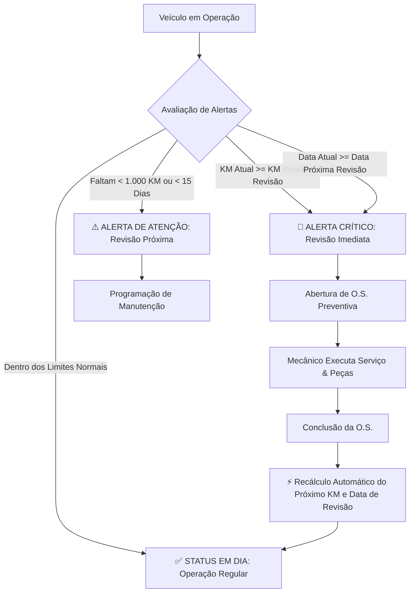

# 🚛 Sistema de Controle de Manutenção de Frotas (Logística)

[](https://nodejs.org/)
[](https://expressjs.com/)
[](http://localhost:3000/api-docs)
[](#-geração-da-release-no-github)
[](LICENSE)

> **Avaliação Parcial (P1) — Disciplina de Desenvolvimento Web**  
> **Aluno:** Gabriel  
> **Tema:** Controle de Manutenção de Frotas (Logística)  


---

## 📌 1. Visão Geral e Tema

O **Controle de Manutenção de Frotas** é um sistema corporativo voltado à gestão logística de frotas de transporte (caminhões, utilitários, vans e veículos leves), com foco primordial na **manutenção preventiva sistemática**, no controle rigoroso de **Ordens de Serviço (O.S.)** — discriminando peças aplicadas e horas de mão de obra mecânica — e na mitigação de falhas operacionais através de um **mecanismo proativo de alertas**.

### 👥 Perfis de Usuário e Casos de Uso:
1. **Gestor de Frota (Logística):**
   - Cadastra e gerencia os veículos da empresa.
   - Associa veículos a planos de manutenção preventiva (com base em periodicidade de KM e tempo).
   - Monitora o painel de alertas críticos (veículos que atingiram o limite de rodagem ou data de revisão).
   - Acompanha custos acumulados em peças e mão de obra através de indicadores analíticos (Dashboard).

2. **Mecânico (Admin / Oficina):**
   - Registra e atualiza Ordens de Serviço (O.S.).
   - Vincula peças substituídas (especificando quantidade e valor unitário).
   - Registra horas trabalhadas e valor hora de mão de obra.
   - Finaliza manutenções preventivas, acionando o **recalculo automatizado do próximo ciclo de revisão do veículo**.

---

## ⚙️ 2. Lógica Central de Alertas e Regras de Negócio

Cada veículo cadastrado possui um **Plano de Manutenção** associado. O sistema avalia dinamicamente dois critérios primordiais:



1. **Alerta Crítico (Revisão Imediata):** Ativado quando a quilometragem atual do veículo atinge ou ultrapassa a `kmProximaRevisao` OU a data atual ultrapassa a `dataProximaRevisao`.
2. **Alerta de Atenção:** Ativado quando faltam **menos de 1.000 km** ou **menos de 15 dias** para o vencimento da revisão preventiva.
3. **Fechamento de O.S. com Recálculo Inteligente:** Ao concluir uma Ordem de Serviço do tipo `PREVENTIVA`, a API atualiza o KM do veículo e projeta automaticamente a próxima revisão com base no intervalo definido no plano (`kmProximaRevisao = kmAtual + intervaloKm` e `dataProximaRevisao = hoje + intervaloMeses`).

---

## 🏗️ 3. Arquitetura e Organização do Código

O projeto adota uma arquitetura em camadas modularizada, limpa e desacoplada:

```
controleManutencaoFrotas/
├── .env.example                # Template de variáveis de ambiente
├── .gitignore                  # Bloqueio de node_modules, envs e logs
├── package.json                # Dependências e scripts npm
├── README.md                   # Documentação mestre do projeto
├── docs/                       # Artefatos técnicos e especificações
│   ├── WIREFRAMES.md           # Mapeamento completo Wireframes <-> API
│   ├── postman_collection.json # Coleção Postman exportada v2.1
│   ├── insomnia_collection.json# Coleção Insomnia exportada v4
│   └── wireframes/             # Protótipos visuais SVG de alta fidelidade
│       ├── 01-dashboard-alertas.svg
│       ├── 02-listagem-veiculos.svg
│       ├── 03-cadastro-veiculo.svg
│       ├── 04-ordens-servico.svg
│       └── 05-detalhes-historico-veiculo.svg
├── public/                     # Interface Web estática (Portal & Wireframes)
│   ├── index.html              # Portal de documentação e status
│   ├── wireframes.html         # Navegador interativo de wireframes e rotas
│   └── css/
│       └── style.css           # Folha de estilos moderna
└── src/                        # Código-fonte da API Node.js
    ├── app.js                  # Configurações Express, CORS, Morgan e Swagger
    ├── server.js               # Ponto de entrada do servidor HTTP
    ├── config/
    │   └── swagger.js          # Especificação OpenAPI 3.0 / Swagger
    ├── controllers/            # Controladores HTTP (validação de I/O)
    │   ├── dashboardController.js
    │   ├── veiculosController.js
    │   ├── ordensServicoController.js
    │   └── planosManutencaoController.js
    ├── services/               # Camada de Regras de Negócio e Cálculos
    │   ├── dashboardService.js
    │   ├── veiculosService.js
    │   ├── ordensServicoService.js
    │   └── planosManutencaoService.js
    ├── middlewares/            # Middlewares (Tratamento de erros e validação)
    │   ├── errorHandler.js
    │   └── requestValidator.js
    ├── data/                   # Persistência em Memória & Seed Data
    │   ├── seedData.js         # Dados iniciais realistas de frota e OS
    │   └── database.js         # Repositório reativo com cálculos dinâmicos
    └── routes/                 # Roteamento RESTful por entidade
        ├── index.js
        ├── dashboardRoutes.js
        ├── veiculosRoutes.js
        ├── ordensServicoRoutes.js
        └── planosManutencaoRoutes.js
```

---

## 🚀 4. Instalação e Execução

### Pré-requisitos:
- [Node.js](https://nodejs.org/) versão 18 ou superior.
- [Git](https://git-scm.com/) instalado.

### Passo a Passo:

1. **Clonar o repositório:**
   ```bash
   git clone https://github.com/Gabriel-lns/controleManutencaoFrotas.git
   cd controleManutencaoFrotas
   ```

2. **Instalar as dependências:**
   ```bash
   npm install
   ```

3. **Configurar variáveis de ambiente (opcional):**
   ```bash
   cp .env.example .env
   ```

4. **Inicializar a API:**
   ```bash
   # Modo de Produção:
   npm start

   # Ou modo de Desenvolvimento com auto-reload:
   npm run dev
   ```

5. **Acessar os Portais no Navegador:**
   - 🌐 **Portal Principal:** [http://localhost:3000](http://localhost:3000)
   - 📄 **Swagger UI (Documentação Interativa):** [http://localhost:3000/api-docs](http://localhost:3000/api-docs)
   - 🎨 **Visualizador Interativo de Wireframes:** [http://localhost:3000/wireframes.html](http://localhost:3000/wireframes.html)
   - 🔍 **Status da API:** [http://localhost:3000/api/status](http://localhost:3000/api/status)

---

## 📚 5. Documentação Completa dos Endpoints da API

A API segue rigorosamente o padrão **RESTful**, utilizando verbos HTTP semânticos (`GET`, `POST`, `PUT`, `PATCH`, `DELETE`) e códigos de status HTTP padronizados (`200 OK`, `201 Created`, `400 Bad Request`, `404 Not Found`, `409 Conflict`, `500 Internal Server Error`).

### 📊 5.1 Dashboard e Alertas (`/api/dashboard`)

| Método | Rota | Descrição | Status Sucesso |
| :---: | :--- | :--- | :---: |
| `GET` | `/api/dashboard/resumo` | Retorna métricas analíticas da frota, status dos veículos, total de OS e custos financeiros de peças/mão de obra. | `200 OK` |
| `GET` | `/api/dashboard/alertas` | Lista detalhada de veículos em situação de alerta crítico (revisão imediata) ou atenção (revisão próxima). | `200 OK` |

#### Exemplo de Resposta — `GET /api/dashboard/alertas`:
```json
{
  "success": true,
  "data": {
    "totalAlertas": 3,
    "alertasCriticos": [
      {
        "veiculoId": 1,
        "placa": "BRA2E19",
        "modelo": "Volvo FH 540 6x4",
        "motorista": "Marcos Oliveira",
        "kmAtual": 92400,
        "kmProximaRevisao": 90000,
        "dataProximaRevisao": "2026-09-10",
        "plano": "Plano Frota Pesada (Caminhões Trucados/Carretas)",
        "gravidade": "CRÍTICA (Revisão Imediata)",
        "motivos": [
          "KM de revisão ultrapassado em 2400 km"
        ],
        "acaoRecomendada": "Abrir Ordem de Serviço Preventiva imediatamente e retirar veículo de rotas longas."
      }
    ],
    "alertasAtencao": [
      {
        "veiculoId": 2,
        "placa": "RQX4F88",
        "modelo": "Mercedes-Benz Accelo 1016",
        "motorista": "Lucas Santana",
        "kmAtual": 39500,
        "kmProximaRevisao": 40000,
        "dataProximaRevisao": "2026-08-30",
        "plano": "Plano Frota Média (Caminhões Urbanos 3/4)",
        "gravidade": "ATENÇÃO (Revisão Próxima)",
        "motivos": [
          "Faltam apenas 500 km para a revisão preventiva"
        ],
        "acaoRecomendada": "Programar agendamento de manutenção para os próximos dias."
      }
    ]
  }
}
```

---

### 🚚 5.2 Veículos (`/api/veiculos`)

| Método | Rota | Descrição | Status Sucesso |
| :---: | :--- | :--- | :---: |
| `GET` | `/api/veiculos` | Lista todos os veículos cadastrados. Suporta filtros via query params (`status`, `marca`, `modelo`, `categoria`, `busca`, `apenasAlertas`). | `200 OK` |
| `GET` | `/api/veiculos/revisao-imediata` | Lista rápida apenas dos veículos que atingiram o limite de KM ou Data. | `200 OK` |
| `GET` | `/api/veiculos/:id` | Busca os dados completos de um veículo específico por ID. | `200 OK` |
| `GET` | `/api/veiculos/:id/historico` | Retorna o histórico de todas as manutenções (Ordens de Serviço) já realizadas no veículo. | `200 OK` |
| `POST` | `/api/veiculos` | Cadastra um novo veículo vinculado a um Plano de Manutenção. | `201 Created` |
| `PUT` | `/api/veiculos/:id` | Atualiza os dados cadastrais do veículo. | `200 OK` |
| `PATCH` | `/api/veiculos/:id/km` | Atualiza especificamente o KM atual do veículo (recalculando alertas). | `200 OK` |
| `DELETE` | `/api/veiculos/:id` | Remove um veículo (valida se não há OS ativas). | `200 OK` |

#### Exemplo de Payload — `POST /api/veiculos`:
```json
{
  "placa": "MER3A89",
  "marca": "Mercedes-Benz",
  "modelo": "Actros 2651 6x4",
  "ano": 2023,
  "kmAtual": 60000,
  "planoManutencaoId": 1,
  "categoria": "Pesado",
  "capacidadeCargaKg": 36000,
  "motoristaResponsavel": "Antônio Prado"
}
```

---

### 🛠️ 5.3 Ordens de Serviço (`/api/ordens-servico`)

| Método | Rota | Descrição | Status Sucesso |
| :---: | :--- | :--- | :---: |
| `GET` | `/api/ordens-servico` | Lista todas as OS (filtros por `status`, `tipo`, `veiculoId`, `mecanico`). | `200 OK` |
| `GET` | `/api/ordens-servico/:id` | Detalhes completos da OS com itens de peças, mão de obra e totais. | `200 OK` |
| `POST` | `/api/ordens-servico` | Abre nova OS com composição de peças e mão de obra. | `201 Created` |
| `PUT` | `/api/ordens-servico/:id` | Atualiza os dados da OS. | `200 OK` |
| `PATCH` | `/api/ordens-servico/:id/status` | Altera o status (`ABERTA`, `EM_ANDAMENTO`, `CONCLUIDA`, `CANCELADA`). Na conclusão preventiva, recalcula o ciclo de revisão do veículo. | `200 OK` |
| `DELETE` | `/api/ordens-servico/:id` | Remove ou cancela uma OS. | `200 OK` |

#### Exemplo de Payload — `POST /api/ordens-servico`:
```json
{
  "veiculoId": 1,
  "tipo": "PREVENTIVA",
  "mecanicoResponsavel": "Carlos Silva (Mecânico Chefe)",
  "kmNoMomento": 92400,
  "descricao": "Revisão periódica preventiva de 90.000 KM",
  "pecas": [
    { "item": "Óleo de Motor 15W40 20L", "quantidade": 2, "valorUnitario": 380.00 },
    { "item": "Filtro de Óleo Lubrificante", "quantidade": 1, "valorUnitario": 140.00 },
    { "item": "Filtro de Ar Primário", "quantidade": 1, "valorUnitario": 290.00 }
  ],
  "maoDeObra": {
    "descricao": "Troca de filtros, óleos e inspeção geral de freios",
    "horas": 6,
    "valorHora": 90.00
  },
  "observacoes": "Veículo deu entrada pela manhã na rampa 01."
}
```

---

### ⚙️ 5.4 Planos de Manutenção Preventiva (`/api/planos-manutencao`)

| Método | Rota | Descrição | Status Sucesso |
| :---: | :--- | :--- | :---: |
| `GET` | `/api/planos-manutencao` | Lista todos os planos preventivos configurados. | `200 OK` |
| `GET` | `/api/planos-manutencao/:id` | Detalhes de um plano específico e itens de checagem. | `200 OK` |
| `POST` | `/api/planos-manutencao` | Cria um novo plano de manutenção. | `201 Created` |
| `PUT` | `/api/planos-manutencao/:id` | Atualiza intervalos ou itens do plano. | `200 OK` |
| `DELETE` | `/api/planos-manutencao/:id` | Remove plano (valida ausência de veículos vinculados). | `200 OK` |

---

## 🎨 6. Wireframes e Planejamento da Interface

Todos os wireframes e o mapeamento dos componentes de tela com cada endpoint da API estão documentados em detalhes no arquivo [`docs/WIREFRAMES.md`](./docs/WIREFRAMES.md) e disponíveis de forma interativa em [http://localhost:3000/wireframes.html](http://localhost:3000/wireframes.html).

### Galeria de Telas do Projeto:

| Tela | Protótipo Visual | Mapeamento Principal de Endpoints |
| :--- | :---: | :--- |
| **1. Dashboard & Alertas** | [Visualizar SVG](./docs/wireframes/01-dashboard-alertas.svg) | `GET /api/dashboard/resumo`<br>`GET /api/dashboard/alertas` |
| **2. Listagem de Veículos** | [Visualizar SVG](./docs/wireframes/02-listagem-veiculos.svg) | `GET /api/veiculos`<br>`PATCH /api/veiculos/:id/km`<br>`DELETE /api/veiculos/:id` |
| **3. Cadastro / Edição** | [Visualizar SVG](./docs/wireframes/03-cadastro-veiculo.svg) | `GET /api/planos-manutencao`<br>`POST /api/veiculos`<br>`PUT /api/veiculos/:id` |
| **4. Ordens de Serviço** | [Visualizar SVG](./docs/wireframes/04-ordens-servico.svg) | `GET /api/ordens-servico`<br>`POST /api/ordens-servico`<br>`PATCH /api/ordens-servico/:id/status` |
| **5. Detalhes & Histórico** | [Visualizar SVG](./docs/wireframes/05-detalhes-historico-veiculo.svg) | `GET /api/veiculos/:id`<br>`GET /api/veiculos/:id/historico` |

---

## 🏷️ 7. Geração da Release no GitHub (`v1.0.0-p1`)

Para cumprir rigorosamente o critério de publicação formal da entrega da P1:

1. **Commit e Push de todo o código para a branch `main`:**
   ```bash
   git add .
   git commit -m "feat: finaliza escopo da avaliacao P1"
   git push origin main
   ```

2. **Criação da Tag e Publicação da Release:**
   - Acesse o repositório no GitHub: `https://github.com/Gabriel-lns/controleManutencaoFrotas`
   - Na lateral direita, clique em **Releases** &rarr; **Draft a new release**.
   - No campo **Choose a tag**, digite `v1.0.0-p1` e clique em **Create new tag: v1.0.0-p1 on target: main**.
   - No campo **Release title**, informe: `Avaliação Parcial P1 - Entrega da API e Wireframes`.
   - No campo de descrição, insira o texto das **Release Notes** abaixo:

```markdown
## Entrega da Avaliação Parcial (P1) — Controle de Manutenção de Frotas (Logística)

### 📦 Recursos Implementados:
- **API REST em Node.js & Express:** Operações completas de CRUD para Veículos, Ordens de Serviço (peças e mão de obra), Planos de Manutenção Preventiva e Dashboard Analítico.
- **Lógica de Alertas Inteligente:** Detecção automática de veículos com revisão vencida (KM ou Data) e recálculo automatizado do ciclo preventivo na conclusão da O.S.
- **Documentação Técnica Completa:** Swagger UI interativo integrado (`/api-docs`), coleção Postman (`docs/postman_collection.json`) e Insomnia (`docs/insomnia_collection.json`).
- **Wireframes & Planejamento de Interface:** 5 telas completas em formato SVG com mapeamento explícito de botões/formulários para os endpoints e visualizador interativo (`/wireframes.html`).
- **Código Limpo e Modular:** Arquitetura em camadas (Controllers, Services, Middlewares, Data/Seed) com validação de inputs e tratamento centralizado de erros.
```

3. Clique no botão verde **"Publish release"**.

---

## ✅ 8. Checklist dos Recursos do Projeto

- [x] Repositório estruturado e versionado via Git.
- [x] Arquivo `.gitignore` configurado (pasta `node_modules` e arquivos sensíveis ignorados).
- [x] API Node.js inicializando sem erros com `npm start` ou `npm run dev`.
- [x] Documentação interativa via Swagger (`/api-docs`), Postman Collection e Insomnia Collection.
- [x] Wireframes visuais em SVG de todas as 5 telas principais com mapeamento completo de rotas.
- [x] Arquivo `README.md` detalhado com requisitos, lógica de negócio, exemplos de requisições/respostas e guia de execução.
- [x] Tag e Release `v1.0.0-p1` documentada e pronta para publicação.

---

### 👨‍💻 Autor
Desenvolvido por **Gabriel** — Projeto de Avaliação Parcial (P1) | Desenvolvimento Web.
