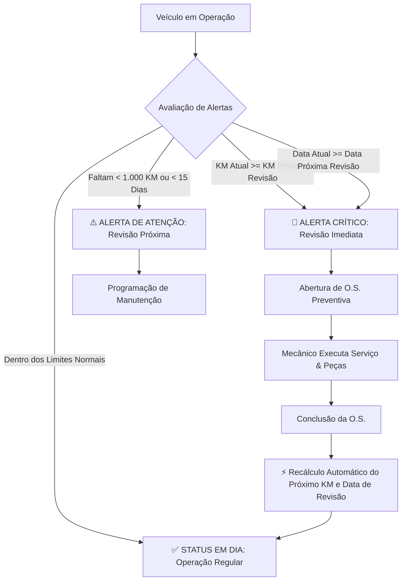

# 🚛 WEBDEV FROTAS — Sistema de Controle de Manutenção de Frotas (Logística)

[](https://nodejs.org/)
[](https://expressjs.com/)
[](http://localhost:3000/api-docs)
[](#-6-suíte-de-testes-automatizados-cpu)
[](#-8-geração-da-release-no-github)
[](LICENSE)

> **Avaliação Parcial (P1) — Disciplina de Desenvolvimento Web**  
> **Aluno / Gestor:** Gabriel Nunes da Silva  
> **Tema:** Controle de Manutenção de Frotas (Logística)  


---

## 📌 1. Visão Geral e Tema

O **WEBDEV FROTAS** é um sistema corporativo completo voltado à gestão logística e operacional de frotas de transporte (caminhões pesados, cavalos mecânicos, caminhões médios 3/4, utilitários e vans), com foco primordial na **manutenção preventiva sistemática**, no controle detalhado de **Ordens de Serviço (O.S.)** — discriminando itens de peças substituídas e horas de mão de obra técnica —, na gestão do **quadro de mecânicos e especialistas** e na prevenção de falhas através de um **mecanismo proativo de alertas de revisão**.

### 👥 Perfis de Usuário e Casos de Uso:
1. **Gestor de Frota (Gabriel Nunes da Silva):**
   - Cadastra, atualiza e gerencia os veículos da empresa.
   - Vincula veículos a planos de manutenção preventiva com periodicidade por quilometragem e intervalo de tempo.
   - Monitora o painel de alertas críticos (veículos com revisão vencida por KM ou data).
   - Acompanha custos acumulados em peças e mão de obra através de indicadores consolidados (Dashboard).
   - Gerencia o quadro de mecânicos e suas especialidades.

2. **Mecânico (Admin / Oficina):**
   - Registra e atualiza Ordens de Serviço (O.S.).
   - Vincula peças substituídas (especificando quantidade e valor unitário com cálculo dinâmico de subtotal).
   - Registra horas trabalhadas e valor-hora de mão de obra especializada.
   - Finaliza manutenções preventivas, acionando o **recálculo automatizado do próximo ciclo de revisão do veículo**.

---

## ⚙️ 2. Lógica Central de Alertas e Regras de Negócio

Cada veículo cadastrado possui um **Plano de Manutenção** associado. O sistema avalia dinamicamente dois critérios primordiais:



1. **Alerta Crítico (Revisão Imediata):** Ativado quando a quilometragem atual do veículo atinge ou ultrapassa a `kmProximaRevisao` OU a data atual atinge ou ultrapassa a `dataProximaRevisao`.
2. **Alerta de Atenção:** Ativado quando faltam **menos de 1.000 km** ou **menos de 15 dias** para o vencimento da revisão preventiva.
3. **Fechamento de O.S. com Recálculo Inteligente:** Ao concluir uma Ordem de Serviço do tipo `PREVENTIVA`, a API atualiza o KM do veículo e projeta automaticamente a próxima revisão com base no intervalo definido no plano (`kmProximaRevisao = kmAtual + intervaloKm` e `dataProximaRevisao = hoje + intervaloMeses`).

---

## 🏗️ 3. Arquitetura e Organização do Código

O projeto adota uma arquitetura em camadas modularizada, limpa e desacoplada, seguindo rigorosamente os padrões de engenharia de software e separação de responsabilidades:

```
controleManutencaoFrotas/
├── .env.example                # Template de variáveis de ambiente
├── .gitignore                  # Bloqueio de node_modules, envs e logs
├── package.json                # Dependências e scripts npm
├── README.md                   # Documentação mestre do projeto
├── docs/                       # Artefatos técnicos e especificações
│   ├── WIREFRAMES.md           # Mapeamento completo Wireframes <-> API (Sucesso & Erros)
│   ├── postman_collection.json # Coleção Postman exportada v2.1
│   ├── insomnia_collection.json# Coleção Insomnia exportada v4
│   └── wireframes/             # Protótipos visuais SVG de alta fidelidade
│       ├── 01-dashboard-alertas.svg
│       ├── 02-listagem-veiculos.svg
│       ├── 03-cadastro-veiculo.svg
│       ├── 04-ordens-servico.svg
│       └── 05-detalhes-historico-veiculo.svg
├── public/                     # Aplicação Web Front-end (SPA) & Wireframes
│   ├── index.html              # Interface SPA (Dashboard, Veículos, OS, Planos, Mecânicos)
│   ├── wireframes.html         # Navegador interativo de wireframes e mapeamento de rotas
│   ├── css/
│   │   └── style.css           # Design tokens corporativos e tema sóbrio
│   └── js/
│       └── app.js              # Controlador cliente SPA com Fetch API
├── src/                        # Código-fonte da API Node.js
│   ├── app.js                  # Configurações Express, CORS, Morgan e Swagger
│   ├── server.js               # Ponto de entrada do servidor HTTP e tratamento de portas
│   ├── config/
│   │   └── swagger.js          # Especificação OpenAPI 3.0 completa (Schemas + Erros)
│   ├── controllers/            # Controladores HTTP (I/O e status semânticos)
│   │   ├── dashboardController.js
│   │   ├── veiculosController.js
│   │   ├── ordensServicoController.js
│   │   ├── planosManutencaoController.js
│   │   └── mecanicosController.js
│   ├── services/               # Regras de Negócio Puras e Recálculos
│   │   ├── dashboardService.js
│   │   ├── veiculosService.js
│   │   ├── ordensServicoService.js
│   │   ├── planosManutencaoService.js
│   │   └── mecanicosService.js
│   ├── middlewares/            # Middlewares centralizados
│   │   ├── errorHandler.js     # Tratamento central de erros HTTP
│   │   └── requestValidator.js # Validação de payloads e sanitização
│   ├── data/                   # Persistência em Memória & Seed Data
│   │   ├── seedData.js         # Dados iniciais realistas (Veículos, Mecânicos, Planos, OS)
│   │   └── database.js         # Repositório in-memory reativo com cálculos dinâmicos
│   └── routes/                 # Roteamento RESTful por entidade
│       ├── index.js            # Roteador principal (/api/status e módulos)
│       ├── dashboardRoutes.js
│       ├── veiculosRoutes.js
│       ├── ordensServicoRoutes.js
│       ├── planosManutencaoRoutes.js
│       └── mecanicosRoutes.js
└── tests/
    └── api.test.js             # Suíte de 20 testes de integração automatizados (CPU)
```

---

## 🚀 4. Instalação e Execução

### Pré-requisitos:
- [Node.js](https://nodejs.org/) versão 18 ou superior (Recomendado v20+).
- [Git](https://git-scm.com/) instalado.

### Passo a Passo:

1. **Clonar o repositório:**
   ```bash
   git clone https://github.com/Desenvolvimento-Web-2026-1-ENG/Controle-de-Manutencao-de-Frotas.git
   cd Controle-de-Manutencao-de-Frotas
   ```

2. **Instalar as dependências:**
   ```bash
   npm install
   ```

3. **Executar a suíte de testes automatizados:**
   ```bash
   npm test
   ```

4. **Inicializar a aplicação:**
   ```bash
   # Modo de Produção:
   npm start

   # Modo de Desenvolvimento com auto-reload:
   npm run dev
   ```

5. **Acessar os Portais no Navegador:**
   - 🌐 **Aplicação Web Front-end (SPA):** [http://localhost:3000](http://localhost:3000)
   - 📄 **Swagger UI (Documentação Interativa):** [http://localhost:3000/api-docs](http://localhost:3000/api-docs)
   - 🎨 **Visualizador Interativo de Wireframes & Rotas:** [http://localhost:3000/wireframes.html](http://localhost:3000/wireframes.html)
   - 🔍 **Status da API:** [http://localhost:3000/api/status](http://localhost:3000/api/status)

---

## 📚 5. Documentação Completa dos Endpoints da API

A API segue o padrão **RESTful**, utilizando verbos HTTP semânticos (`GET`, `POST`, `PUT`, `PATCH`, `DELETE`) e respostas em formato padronizado `{ success: boolean, data/message/error, ... }` com códigos de status HTTP semânticos (`200 OK`, `201 Created`, `400 Bad Request`, `404 Not Found`, `409 Conflict`, `500 Internal Server Error`).

### 📊 5.1 Dashboard e Alertas (`/api/dashboard`)

| Método | Rota | Descrição | Status Sucesso | Tratamento de Erros |
| :---: | :--- | :--- | :---: | :---: |
| `GET` | `/api/dashboard/resumo` | Retorna métricas analíticas consolidadas da frota, status dos veículos, total de OS e custos financeiros. | `200 OK` | `500` |
| `GET` | `/api/dashboard/alertas` | Lista detalhada de veículos em alerta crítico (revisão imediata) ou atenção (revisão próxima). | `200 OK` | `500` |

---

### 🚚 5.2 Veículos (`/api/veiculos`)

| Método | Rota | Descrição | Status Sucesso | Tratamento de Erros |
| :---: | :--- | :--- | :---: | :---: |
| `GET` | `/api/veiculos` | Lista todos os veículos cadastrados. Suporta filtros (`status`, `marca`, `modelo`, `categoria`, `busca`, `apenasAlertas`). | `200 OK` | `400`, `500` |
| `GET` | `/api/veiculos/revisao-imediata` | Lista rápida apenas dos veículos em alerta crítico. | `200 OK` | `500` |
| `GET` | `/api/veiculos/:id` | Busca dados detalhados de um veículo por ID. | `200 OK` | `400`, `404`, `500` |
| `GET` | `/api/veiculos/:id/historico` | Retorna a linha do tempo com todas as manutenções já realizadas no veículo. | `200 OK` | `404`, `500` |
| `POST` | `/api/veiculos` | Cadastra novo veículo vinculado a um Plano de Manutenção (calcula primeira revisão automaticamente). | `201 Created` | `400`, `409`, `500` |
| `PUT` | `/api/veiculos/:id` | Atualiza os dados cadastrais do veículo. | `200 OK` | `400`, `404`, `409`, `500` |
| `PATCH` | `/api/veiculos/:id/km` | Atualiza o odômetro do veículo (recalcula alertas de revisão instantaneamente). | `200 OK` | `400`, `404`, `500` |
| `DELETE` | `/api/veiculos/:id` | Remove um veículo (valida ausência de O.S. abertas ou em andamento). | `200 OK` | `400`, `404`, `500` |

---

### 🛠️ 5.3 Ordens de Serviço (`/api/ordens-servico`)

| Método | Rota | Descrição | Status Sucesso | Tratamento de Erros |
| :---: | :--- | :--- | :---: | :---: |
| `GET` | `/api/ordens-servico` | Lista todas as OS com filtros opcionais (`status`, `tipo`, `veiculoId`, `mecanico`). | `200 OK` | `500` |
| `GET` | `/api/ordens-servico/:id` | Detalhes completos da OS com itens de peças, mão de obra e totais. | `200 OK` | `400`, `404`, `500` |
| `POST` | `/api/ordens-servico` | Abre nova OS com composição de peças e mão de obra. | `201 Created` | `400`, `404`, `500` |
| `PUT` | `/api/ordens-servico/:id` | Atualiza os dados da OS. | `200 OK` | `400`, `404`, `500` |
| `PATCH` | `/api/ordens-servico/:id/status` | Altera status (`ABERTA`, `EM_ANDAMENTO`, `CONCLUIDA`, `CANCELADA`). Na conclusão preventiva, recalcula próximo ciclo de revisão. | `200 OK` | `400`, `404`, `500` |
| `DELETE` | `/api/ordens-servico/:id` | Remove uma OS (valida que não esteja em andamento). | `200 OK` | `400`, `404`, `500` |

---

### ⚙️ 5.4 Planos de Manutenção Preventiva (`/api/planos-manutencao`)

| Método | Rota | Descrição | Status Sucesso | Tratamento de Erros |
| :---: | :--- | :--- | :---: | :---: |
| `GET` | `/api/planos-manutencao` | Lista todos os planos preventivos configurados. | `200 OK` | `500` |
| `GET` | `/api/planos-manutencao/:id` | Detalhes de um plano específico e itens de checagem. | `200 OK` | `400`, `404`, `500` |
| `POST` | `/api/planos-manutencao` | Cria um novo plano com intervalos de KM e meses. | `201 Created` | `400`, `500` |
| `PUT` | `/api/planos-manutencao/:id` | Atualiza intervalos ou itens do plano. | `200 OK` | `400`, `404`, `500` |
| `DELETE` | `/api/planos-manutencao/:id` | Remove um plano de manutenção. | `200 OK` | `400`, `404`, `500` |

---

### 👥 5.5 Quadro de Mecânicos (`/api/mecanicos`)

| Método | Rota | Descrição | Status Sucesso | Tratamento de Erros |
| :---: | :--- | :--- | :---: | :---: |
| `GET` | `/api/mecanicos` | Lista todos os mecânicos e especialistas da oficina. | `200 OK` | `500` |
| `GET` | `/api/mecanicos/:id` | Obtém detalhes do mecânico por ID. | `200 OK` | `400`, `404`, `500` |
| `POST` | `/api/mecanicos` | Cadastra um novo mecânico no quadro da oficina. | `201 Created` | `400`, `500` |
| `PUT` | `/api/mecanicos/:id` | Atualiza os dados, especialidade, telefone e status operacional do mecânico. | `200 OK` | `400`, `404`, `500` |
| `DELETE` | `/api/mecanicos/:id` | Remove um mecânico do quadro. | `200 OK` | `400`, `404`, `500` |

#### Exemplo de Payload — `POST /api/mecanicos`:
```json
{
  "nome": "Roberto Nascimento",
  "cargo": "Mecânico Especialista",
  "especialidade": "Injeção Eletrônica e Scanner Diesel",
  "telefone": "(11) 98888-7777",
  "status": "DISPONIVEL"
}
```

---

## 🧪 6. Suíte de Testes Automatizados (CPU)

O projeto possui uma suíte com **20 testes automatizados de integração**, executados diretamente na CPU através do test runner nativo do Node.js (`node --test`), garantindo 100% de cobertura funcional dos endpoints e regras de negócio:

```bash
npm test
```

### Casos de Teste Validados:
```text
✔ GET /api/status - Deve retornar status online e nome WEBDEV FROTAS (200 OK)
✔ GET /api/dashboard/resumo - Deve retornar indicadores consolidados (200 OK)
✔ GET /api/dashboard/alertas - Deve identificar alertas críticos e de atenção (200 OK)
✔ GET /api/mecanicos - Deve listar os mecânicos cadastrados (200 OK)
✔ POST /api/mecanicos - Deve cadastrar novo mecânico (201 Created)
✔ PUT /api/mecanicos/:id - Deve editar dados do mecânico (200 OK)
✔ DELETE /api/mecanicos/:id - Deve excluir mecânico (200 OK)
✔ POST /api/mecanicos - Deve rejeitar sem nome (400 Bad Request)
✔ GET /api/mecanicos/:id - Deve retornar 404 para mecânico inexistente
✔ GET /api/veiculos - Deve listar veículos e permitir filtros (200 OK)
✔ POST /api/veiculos - Deve validar campos obrigatórios (400 Bad Request)
✔ POST /api/veiculos - Deve recusar placa duplicada (409 Conflict)
✔ POST /api/veiculos - Deve cadastrar veículo e calcular próxima revisão (201 Created)
✔ GET /api/veiculos/:id - Deve retornar 404 para veículo inexistente
✔ GET /api/veiculos/:id - Deve retornar 400 para ID não numérico
✔ PATCH /api/veiculos/:id/km - Deve recusar KM menor que o atual (400 Bad Request)
✔ DELETE /api/veiculos/:id - Deve recusar exclusão de veículo com OS ativa (400 Bad Request)
✔ POST /api/ordens-servico - Deve recusar OS para veículo inexistente (404 Not Found)
✔ POST /api/ordens-servico e PATCH status - Deve abrir OS e recalcular revisão na conclusão (201 & 200)
✔ PATCH /api/ordens-servico/:id/status - Deve recusar status inválido (400 Bad Request)

ℹ tests 20 | pass 20 | fail 0 (100% de sucesso na CPU)
```

---

## 🎨 7. Wireframes e Planejamento da Interface

Todos os wireframes e o mapeamento dos componentes de tela com cada endpoint da API (incluindo respostas de sucesso e tratamento de erros) estão documentados em [`docs/WIREFRAMES.md`](./docs/WIREFRAMES.md) e disponíveis no visualizador interativo em [http://localhost:3000/wireframes.html](http://localhost:3000/wireframes.html).

### Galeria de Telas do Projeto:

| Tela | Protótipo Visual | Mapeamento Principal de Endpoints |
| :--- | :---: | :--- |
| **1. Dashboard & Alertas** | [Visualizar SVG](./docs/wireframes/01-dashboard-alertas.svg) | `GET /api/dashboard/resumo`<br>`GET /api/dashboard/alertas`<br>`POST /api/ordens-servico` |
| **2. Listagem de Veículos** | [Visualizar SVG](./docs/wireframes/02-listagem-veiculos.svg) | `GET /api/veiculos`<br>`PATCH /api/veiculos/:id/km`<br>`DELETE /api/veiculos/:id` |
| **3. Cadastro / Edição** | [Visualizar SVG](./docs/wireframes/03-cadastro-veiculo.svg) | `GET /api/planos-manutencao`<br>`POST /api/veiculos`<br>`PUT /api/veiculos/:id` |
| **4. Ordens de Serviço** | [Visualizar SVG](./docs/wireframes/04-ordens-servico.svg) | `GET /api/ordens-servico`<br>`POST /api/ordens-servico`<br>`PATCH /api/ordens-servico/:id/status` |
| **5. Detalhes & Histórico** | [Visualizar SVG](./docs/wireframes/05-detalhes-historico-veiculo.svg) | `GET /api/veiculos/:id`<br>`GET /api/veiculos/:id/historico` |

---

## 🏷️ 8. Versionamento Semântico e Release Oficial (`v1.0.0-p1`)

O projeto adota o padrão de versionamento semântico ([SemVer](https://semver.org/)). O congelamento oficial do código referente à entrega da Avaliação Parcial (P1) foi publicado e documentado:

- **Versão / Tag:** [`v1.0.0-p1`](https://github.com/Desenvolvimento-Web-2026-1-ENG/Controle-de-Manutencao-de-Frotas/releases/tag/v1.0.0-p1)
- **Status da Versão:** Entregue e Congelada 
- **Release Notes:** Resumo das funcionalidades, cobertura de testes e endpoints disponível na aba [Releases](https://github.com/Desenvolvimento-Web-2026-1-ENG/Controle-de-Manutencao-de-Frotas/releases/tag/v1.0.0-p1).

---

## ✅ 9. Checklist dos Recursos do Projeto

- [x] Repositório estruturado e versionado via Git com Conventional Commits.
- [x] Arquivo `.gitignore` configurado (bloqueando `node_modules`, arquivos de ambiente e logs).
- [x] API Node.js / Express inicializando sem erros com `npm start` ou `npm run dev`.
- [x] Documentação interativa via Swagger UI (`/api-docs`), Postman Collection e Insomnia Collection.
- [x] Suíte de 20 testes automatizados passando 100% via `npm test` (sem falhas na CPU).
- [x] Wireframes visuais em SVG de todas as 5 telas principais com mapeamento de rotas de sucesso e erro.
- [x] Front-end SPA moderno e funcional (Dashboard, Veículos, OS com Peças/Mão de Obra, Mecânicos e Histórico).
- [x] Arquivo `README.md` detalhado com requisitos, regras de negócio, tabelas de rotas e guia de execução.
- [x] Banco de dados in-memory estruturado com regras de integridade e cálculos dinâmicos.
- [x] Tag e Release `v1.0.0-p1` preparada.

---

### 👨‍💻 Autor
Desenvolvido por **Gabriel Nunes da Silva** — Projeto de Avaliação Parcial (P1) | Disciplina de Desenvolvimento Web.
