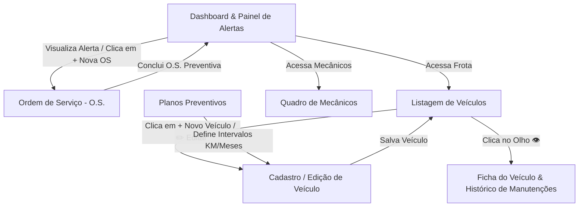

# 🎨 Planejamento de Interface e Wireframes (Front-end)

Este documento apresenta os **Wireframes** de baixa e média fidelidade das telas que compõem o sistema **WEBDEV FROTAS**, acompanhados da especificação técnica completa de **Mapeamento de Integração com a API Node.js** (endpoints, verbos HTTP, payloads, respostas de sucesso e **tratamento exaustivo de erros 400, 404, 409 e 500**).

---

## 🧭 Visão Geral do Fluxo de Telas e Perfis

---

## 📱 Telas Projetadas e Mapeamento de Endpoints (Sucesso & Erro)

### 1. Tela 1 — Dashboard e Painel de Alertas de Revisão Imediata
- **Objetivo:** Permitir ao Gestor de Frota (Gabriel Nunes) e ao Mecânico visualizar rapidamente os indicadores operacionais da frota, custos acumulados e a lista prioritária de veículos com revisão preventiva vencida ou próxima.
- **Arquivo Visual:** [`docs/wireframes/01-dashboard-alertas.svg`](./wireframes/01-dashboard-alertas.svg)

#### 🔗 Mapeamento de Integração com a API:
| Componente / Ação | Evento / Disparo | Método | Endpoint da API | Payload (Request) | Resposta Sucesso | Tratamento de Erros & Validações |
| :--- | :--- | :---: | :--- | :--- | :--- | :--- |
| **Cards de Indicadores (KPIs)** | Carregamento da página (`DOMContentLoaded`) | `GET` | `/api/dashboard/resumo` | Nenhum | `200 OK` com totais de veículos, OS e financeiro | `500` - Erro interno na agregação |
| **Tabela de Alertas de Revisão** | Carregamento da página | `GET` | `/api/dashboard/alertas` | Nenhum | `200 OK` com lista de alertas (`CRITICO` e `ATENCAO`) | `500` - Erro interno no processamento de alertas |
| **Botão "Criar O.S."** | Clique na linha do veículo | `POST` | `/api/ordens-servico` | `{ veiculoId, tipo: 'PREVENTIVA' }` | `201 Created` - Cria OS e abre modal | `400` - Dados obrigatórios ausentes \| `404` - Veículo inexistente |

---

### 2. Tela 2 — Listagem e Gestão da Frota de Veículos
- **Objetivo:** Listar todos os veículos cadastrados na frota, com badges de status operacional, status de revisão calculada, filtros por status/categoria e barra de busca.
- **Arquivo Visual:** [`docs/wireframes/02-listagem-veiculos.svg`](./wireframes/02-listagem-veiculos.svg)

#### 🔗 Mapeamento de Integração com a API:
| Componente / Ação | Evento / Disparo | Método | Endpoint da API | Payload (Request) | Resposta Sucesso | Tratamento de Erros & Validações |
| :--- | :--- | :---: | :--- | :--- | :--- | :--- |
| **Tabela de Veículos** | Carregamento e filtros | `GET` | `/api/veiculos?busca=...&status=...` | Query params | `200 OK` com array completo de veículos enriquecidos | `400` - Parâmetro inválido \| `500` - Erro interno |
| **Botão "Apenas Alertas"** | Clique no toggle | `GET` | `/api/veiculos?apenasAlertas=true` | Query string | `200 OK` com veículos que necessitam de atenção | `500` - Erro interno |
| **Atualização Rápida de KM ⚡** | Envio do modal de odômetro | `PATCH` | `/api/veiculos/:id/km` | `{"kmAtual": 95000}` | `200 OK` com novos alertas calculados | `400` - KM menor que o atual ou negativo \| `404` - Veículo inexistente |
| **Excluir Veículo 🗑️** | Clique + Confirmação | `DELETE` | `/api/veiculos/:id` | ID via `req.params` | `200 OK` confirmando exclusão | `400` - Veículo possui O.S. aberta ou em andamento \| `404` - ID inexistente |

---

### 3. Tela 3 — Cadastro e Edição de Veículo
- **Objetivo:** Formulário completo para inclusão ou atualização de veículos, associando a um Plano de Manutenção Preventiva para cálculo automático dos ciclos de revisão.
- **Arquivo Visual:** [`docs/wireframes/03-cadastro-veiculo.svg`](./wireframes/03-cadastro-veiculo.svg)

#### 🔗 Mapeamento de Integração com a API:
| Componente / Ação | Evento / Disparo | Método | Endpoint da API | Payload (Request) | Resposta Sucesso | Tratamento de Erros & Validações |
| :--- | :--- | :---: | :--- | :--- | :--- | :--- |
| **Select de Planos Preventivos** | Carregamento do form | `GET` | `/api/planos-manutencao` | Nenhum | `200 OK` com lista de planos disponíveis | `500` - Erro interno |
| **Formulário de Cadastro (Novo)** | `submit` do formulário | `POST` | `/api/veiculos` | `{ placa, marca, modelo, ano, kmAtual, planoManutencaoId, ... }` | `201 Created` com próximo ciclo calculado | `400` - Campos obrigatórios ausentes \| `409` - Placa já cadastrada no sistema |
| **Formulário de Edição (Existente)** | `submit` do formulário | `PUT` | `/api/veiculos/:id` | Objeto com dados alterados | `200 OK` com dados atualizados | `400` - Dados inválidos \| `404` - Veículo inexistente \| `409` - Placa em conflito com outro veículo |

---

### 4. Tela 4 — Abertura e Composição de Ordem de Serviço (O.S.)
- **Objetivo:** Interface utilizada pelo **Mecânico (Admin)** para registrar serviços de manutenção, adicionando dinamicamente peças e cálculo de mão de obra.
- **Arquivo Visual:** [`docs/wireframes/04-ordens-servico.svg`](./wireframes/04-ordens-servico.svg)

#### 🔗 Mapeamento de Integração com a API:
| Componente / Ação | Evento / Disparo | Método | Endpoint da API | Payload (Request) | Resposta Sucesso | Tratamento de Erros & Validações |
| :--- | :--- | :---: | :--- | :--- | :--- | :--- |
| **Select de Veículos e Mecânicos** | Abertura do modal | `GET` | `/api/veiculos` e `/api/mecanicos` | Nenhum | `200 OK` para popular seletores | `500` - Erro interno |
| **Formulário de Abertura de OS** | `submit` do formulário | `POST` | `/api/ordens-servico` | `{ veiculoId, tipo, mecanicoResponsavel, kmNoMomento, descricao, pecas: [...], maoDeObra: {...} }` | `201 Created` com totais calculados | `400` - veiculoId ou descrição ausentes \| `404` - Veículo não encontrado |
| **Botão "Concluir O.S." ✓** | Clique do Mecânico | `PATCH` | `/api/ordens-servico/:id/status` | `{"status": "CONCLUIDA"}` | `200 OK` (recalcula ciclo preventivo) | `400` - Status inválido \| `404` - O.S. inexistente |
| **Excluir O.S. 🗑️** | Clique de exclusão | `DELETE` | `/api/ordens-servico/:id` | ID via `req.params` | `200 OK` confirmando exclusão | `400` - O.S. em andamento não pode ser excluída \| `404` - ID inexistente |

---

### 5. Tela 5 — Ficha do Veículo & Histórico de Manutenções
- **Objetivo:** Apresentar a visão 360° de um veículo específico, incluindo dados cadastrais, plano ativo, status de revisão e a **linha do tempo de todas as manutenções realizadas** com custos discriminados.
- **Arquivo Visual:** [`docs/wireframes/05-detalhes-historico-veiculo.svg`](./wireframes/05-detalhes-historico-veiculo.svg)

#### 🔗 Mapeamento de Integração com a API:
| Componente / Ação | Evento / Disparo | Método | Endpoint da API | Payload (Request) | Resposta Sucesso | Tratamento de Erros & Validações |
| :--- | :--- | :---: | :--- | :--- | :--- | :--- |
| **Cabeçalho e Ficha do Veículo** | Abertura do modal | `GET` | `/api/veiculos/:id` | ID via `req.params` | `200 OK` com dados cadastrais e alertas | `400` - ID inválido \| `404` - Veículo inexistente |
| **Timeline de Manutenções** | Carregamento do histórico | `GET` | `/api/veiculos/:id/historico` | ID via `req.params` | `200 OK` com lista ordenada de manutenções | `404` - Veículo inexistente \| `500` - Erro interno |

---

## 🖥️ Visualizador Interativo de Wireframes
Você pode visualizar e navegar pelos wireframes de forma interativa acessando no navegador:
👉 **`http://localhost:3000/wireframes.html`**
