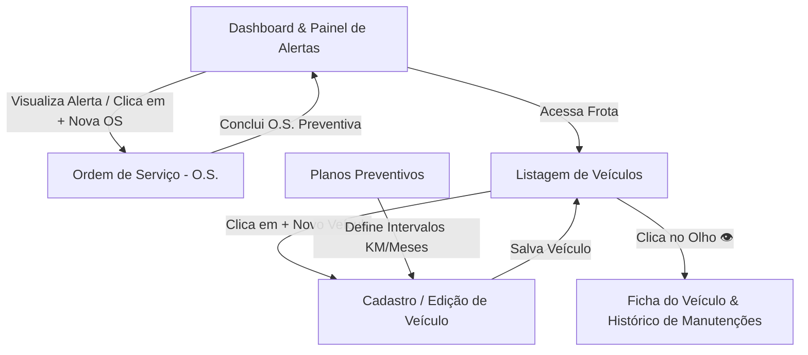

# 🎨 Planejamento de Interface e Wireframes (Front-end)

Este documento apresenta os **Wireframes** de baixa e média fidelidade das telas que compõem o sistema de **Controle de Manutenção de Frotas**, acompanhados da especificação técnica detalhada de **Mapeamento de Integração com a API Node.js** (endpoints, verbos HTTP, payloads e respostas esperadas).

---

## 🧭 Visão Geral do Fluxo de Telas e Perfis

---

## 📱 Telas Projetadas e Mapeamento de Endpoints

### 1. Tela 1 — Dashboard e Painel de Alertas de Revisão Imediata
- **Objetivo:** Permitir ao Gestor de Frota e Mecânico visualizar rapidamente os indicadores operacionais da frota, custos acumulados e a lista prioritária de veículos com revisão preventiva vencida ou próxima.
- **Arquivo Visual:** [`docs/wireframes/01-dashboard-alertas.svg`](./wireframes/01-dashboard-alertas.svg)

#### 🔗 Mapeamento de Integração com a API:
| Componente / Ação | Evento / Disparo | Método | Endpoint da API | Payload (Request) | Resposta Esperada |
| :--- | :--- | :---: | :--- | :--- | :--- |
| **Cards de Indicadores (KPIs)** | Carregamento da página (`DOMContentLoaded`) | `GET` | `/api/dashboard/resumo` | Nenhum | `200 OK` com totais de veículos, OS e financeiro |
| **Tabela / Cards de Alertas Críticos** | Carregamento da página | `GET` | `/api/dashboard/alertas` | Nenhum | `200 OK` com lista de alertas (`CRITICO` e `ATENCAO`) |
| **Botão "+ Abrir O.S." no Card de Alerta** | Clique do usuário | `Redirecionamento` | `/ordens-servico.html?veiculoId=1&tipo=PREVENTIVA` | `veiculoId`, `kmNoMomento` | Pré-preenche o formulário de abertura de OS |

---

### 2. Tela 2 — Listagem e Gestão da Frota de Veículos
- **Objetivo:** Listar todos os veículos cadastrados na frota, com badges de status operacional, status de revisão calculada, filtros por status/categoria e barra de busca.
- **Arquivo Visual:** [`docs/wireframes/02-listagem-veiculos.svg`](./wireframes/02-listagem-veiculos.svg)

#### 🔗 Mapeamento de Integração com a API:
| Componente / Ação | Evento / Disparo | Método | Endpoint da API | Payload (Request) | Resposta Esperada |
| :--- | :--- | :---: | :--- | :--- | :--- |
| **Tabela de Veículos** | Carregamento inicial | `GET` | `/api/veiculos` | Query params opcionais | `200 OK` com array completo de veículos enriquecidos |
| **Barra de Busca e Filtros** | `input` / `change` dos selects | `GET` | `/api/veiculos?busca={termo}&status={status}&categoria={cat}` | Query string | `200 OK` com lista filtrada |
| **Botão "Apenas Alertas"** | Clique no botão | `GET` | `/api/veiculos?apenasAlertas=true` | Query string | `200 OK` com veículos que necessitam de revisão |
| **Ícone de Exclusão 🗑️** | Clique + Confirmação | `DELETE` | `/api/veiculos/:id` | ID via `req.params` | `200 OK` confirmando exclusão (ou `400` se houver OS ativa) |
| **Modal Rápido de Atualizar KM** | Envio do form | `PATCH` | `/api/veiculos/:id/km` | `{"kmAtual": 95000}` | `200 OK` com dados atualizados |

---

### 3. Tela 3 — Cadastro e Edição de Veículo
- **Objetivo:** Formulário completo para inclusão ou atualização de veículos, associando a um Plano de Manutenção Preventiva para cálculo automático dos ciclos de revisão.
- **Arquivo Visual:** [`docs/wireframes/03-cadastro-veiculo.svg`](./wireframes/03-cadastro-veiculo.svg)

#### 🔗 Mapeamento de Integração com a API:
| Componente / Ação | Evento / Disparo | Método | Endpoint da API | Payload (Request) | Resposta Esperada |
| :--- | :--- | :---: | :--- | :--- | :--- |
| **Select de Planos de Manutenção** | Carregamento do form | `GET` | `/api/planos-manutencao` | Nenhum | `200 OK` com lista de planos para preencher o select |
| **Formulário de Cadastro (Novo)** | `submit` do formulário | `POST` | `/api/veiculos` | `{ placa, marca, modelo, ano, kmAtual, planoManutencaoId, categoria, motoristaResponsavel }` | `201 Created` com dados do veículo criado |
| **Formulário de Edição (Existente)** | `submit` do formulário | `PUT` | `/api/veiculos/:id` | Objeto com dados alterados | `200 OK` com dados atualizados |

---

### 4. Tela 4 — Abertura e Composição de Ordem de Serviço (O.S.)
- **Objetivo:** Interface utilizada principalmente pelo perfil **Mecânico (Admin)** para registrar serviços de manutenção, adicionando dinamicamente peças (quantidade e valor unitário) e horas de mão de obra.
- **Arquivo Visual:** [`docs/wireframes/04-ordens-servico.svg`](./wireframes/04-ordens-servico.svg)

#### 🔗 Mapeamento de Integração com a API:
| Componente / Ação | Evento / Disparo | Método | Endpoint da API | Payload (Request) | Resposta Esperada |
| :--- | :--- | :---: | :--- | :--- | :--- |
| **Select de Veículos** | Carregamento da página | `GET` | `/api/veiculos` | Nenhum | `200 OK` para popular o seletor |
| **Formulário de Abertura de OS** | `submit` do formulário | `POST` | `/api/ordens-servico` | `{ veiculoId, tipo, mecanicoResponsavel, kmNoMomento, descricao, pecas: [...], maoDeObra: {...} }` | `201 Created` com código gerado (ex: `OS-2026-004`) |
| **Botão "Em Andamento"** | Clique | `PATCH` | `/api/ordens-servico/:id/status` | `{"status": "EM_ANDAMENTO"}` | `200 OK` (muda veículo para `EM_MANUTENCAO`) |
| **Botão "Concluir e Liberar"** | Clique + Confirmação | `PATCH` | `/api/ordens-servico/:id/status` | `{"status": "CONCLUIDA", "observacoes": "..."}` | `200 OK` (recalcula próximo KM/data de revisão) |

---

### 5. Tela 5 — Ficha do Veículo & Histórico de Manutenções
- **Objetivo:** Apresentar a visão 360° de um veículo específico, incluindo dados cadastrais, plano ativo, status de revisão e a **linha do tempo de todas as manutenções realizadas** com custos discriminados.
- **Arquivo Visual:** [`docs/wireframes/05-detalhes-historico-veiculo.svg`](./wireframes/05-detalhes-historico-veiculo.svg)

#### 🔗 Mapeamento de Integração com a API:
| Componente / Ação | Evento / Disparo | Método | Endpoint da API | Payload (Request) | Resposta Esperada |
| :--- | :--- | :---: | :--- | :--- | :--- |
| **Cabeçalho / Dados do Veículo** | Carregamento (`/veiculo-detalhes.html?id=1`) | `GET` | `/api/veiculos/1` | ID via `req.params` | `200 OK` com dados cadastrais e cálculo de alertas |
| **Timeline de Manutenções Realizadas** | Carregamento | `GET` | `/api/veiculos/1/historico` | ID via `req.params` | `200 OK` com lista ordenada de ordens de serviço |

---

## 🖥️ Visualizador Interativo de Wireframes
Você pode visualizar e navegar pelos wireframes de forma interativa acessando no navegador:
👉 **`http://localhost:3000/wireframes.html`**
